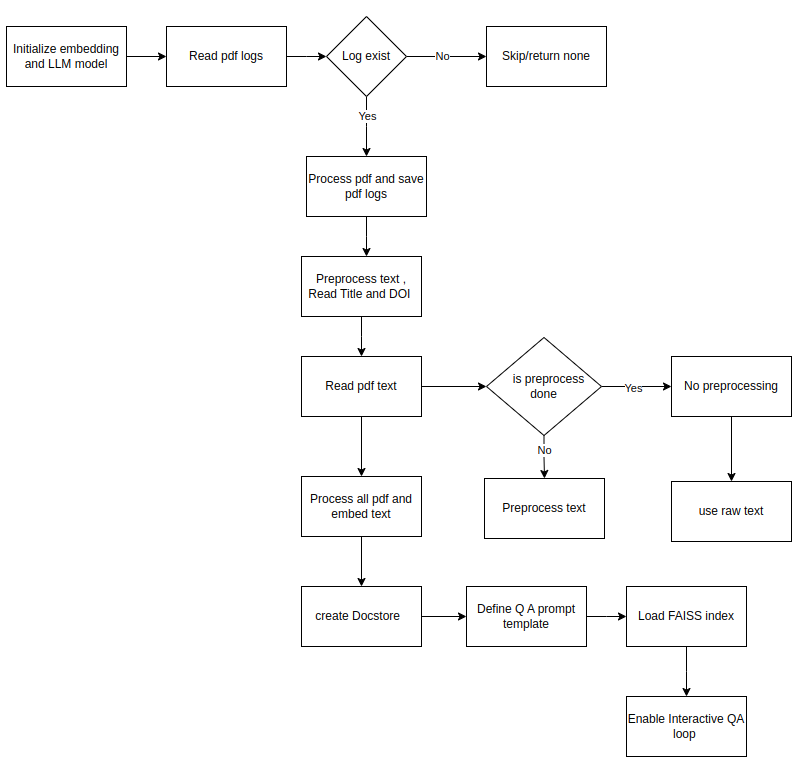

# Doc_based_Q_A_using_RAG

This repository demonstrates an efficient method for question answering using LLM models. It creates a document store, tracks processed PDFs, and stores the title and DOI of each processed paper to provide accurate references in its responses.
 

## Overview

The project involves the following steps:
1. **Initialize Embeddings and LLM Model**: Uses OpenAI's embedding model and GPT-3.5-Turbo-16k/gpt-4o.
2. **Read PDFs Log**: Checks if `pdfs_log.json` exists and loads the processed PDFs.
3. **Get All PDFs Names**: Lists all PDF files in the specified directory.
4. **Save PDFs Log**: Saves the log of processed PDFs to `pdfs_log.json`.
5. **Preprocess Texts**: Splits raw text into manageable chunks.
6. **Read Titles and DOIs**: Loads titles and DOIs from a JSON file.
7. **Read PDF Text**: Extracts text from each PDF and optionally preprocesses it.
8. **Process All PDFs**: Loops through all PDFs to read and preprocess texts, collecting all texts.
9. **Embed Texts**: Initializes embeddings, splits texts, and creates a FAISS docstore from text chunks.
10. **Create Docstore**: Reads processed PDFs log, identifies PDFs to process, reads titles and DOIs, processes and embeds texts, and saves the docstore.
11. **Define QA Prompt Template**: Defines the prompt for the Q&A system.
12. **Load FAISS Index**: Loads the saved FAISS index.
13. **Create Retriever**: Converts the FAISS index to a retriever.
14. **Create Conversation Buffer Memory**: Creates a memory buffer for conversation history.
15. **Create Conversational Retrieval Chain**: Uses the LLM for conversational retrieval.
16. **Interactive QA Loop**: Provides an interactive loop for querying and retrieving answers.
